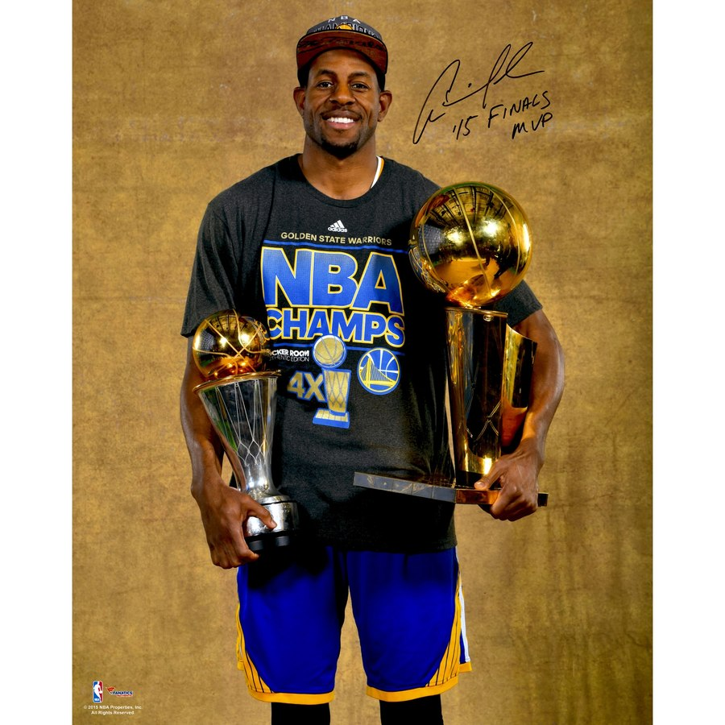

# Statistical Analysis of Warriors Championship Run as a Jump Shooting Team


```{r echo=FALSE, message = FALSE, warning = FALSE}
# Loading in dplyr package
library("dplyr")
library("gridExtra")
library("knitr")
# Reading in shots-data dataset
shots_data <- read.csv("../data/shots-data.csv", stringsAsFactors = FALSE)
```


```{r echo = FALSE, message = FALSE, warning = FALSE}
# Two pt table
raw_two_pt_table <- count(group_by(select(shots_data[shots_data$shot_type == "2PT Field Goal", ], name, shot_made_flag, shot_type), name, shot_made_flag, shot_type), shot_made_flag)
name <- character(0)
total <- numeric(0)
made <- numeric(0)
for (i in seq(1, nrow(raw_two_pt_table), by = 2)){
  name <- c(name, raw_two_pt_table$name[i])
  made <- c(made, raw_two_pt_table$n[i+1])
  total <- c(total, raw_two_pt_table$n[i] + raw_two_pt_table$n[i+1])
}
perc_made <- round(made / total * 100, 2)
two_pt_table <- arrange(data.frame(name, total, made, perc_made), desc(perc_made))
```

```{r echo = FALSE, message=FALSE}
# Three pt table
raw_three_pt_table <- count(group_by(select(shots_data[shots_data$shot_type == "3PT Field Goal", ], name, shot_made_flag, shot_type), name, shot_made_flag, shot_type), shot_made_flag)
name <- character(0)
total <- numeric(0)
made <- numeric(0)
for (i in seq(1, nrow(raw_three_pt_table), by = 2)){
  name <- c(name, raw_three_pt_table$name[i])
  made <- c(made, raw_three_pt_table$n[i+1])
  total <- c(total, raw_three_pt_table$n[i] + raw_three_pt_table$n[i+1])
}
perc_made <- round(made / total * 100, 2)
three_pt_table <- arrange(data.frame(name, total, made, perc_made), desc(perc_made))
```

```{r echo = FALSE, message = FALSE}
# Pt table
raw_pt_table <- count(group_by(select(shots_data, name, shot_made_flag, shot_type), name, shot_made_flag, shot_type), shot_made_flag)
name <- character(0)
total <- numeric(0)
made <- numeric(0)
for (i in seq(1, nrow(raw_pt_table), by = 4)){
  name <- c(name, raw_pt_table$name[i])
  made <- c(made, raw_pt_table$n[i+2] + raw_pt_table$n[i+3])
  total <- c(total, raw_pt_table$n[i] + raw_pt_table$n[i+1] + raw_pt_table$n[i+2] + raw_pt_table$n[i+3])
}
perc_made <- round(made / total * 100, 2)
pt_table <- arrange(data.frame(name, total, made, perc_made), desc(perc_made))
```

### Introduction
After coming from one of the biggest heartbreaks and disappointing final results in NBA history after a record-breaking regular season, the Warriors front office amazingly were able to sign one of the best basketball players on the planet. Kevin Durant would join the tandem of Steph Curry, Draymond Green, Klay Thompson, and Andre Iguodala to form arguably one of the best teams in NBA history. However, the infamous Charles Barkley still had his doubts about the Warrior's goal towards a championship. He claimed, "A jump-shooting team would never win the championship." However, with statistical evidence on their side (with obviously hours of jump shot practice), the team proves the ESPN analyst wrong. This article also discusses the importance of Andre Iguodala and justifies his previous Finals MVP accomplishment.

### Data
Here are a few tables that show the effective percentage for the different FG attempts for each player.

##### 2 Pointer Effective Shooting Percentage
```{r echo = FALSE, message = FALSE}
kable(two_pt_table, caption = "Effective Shooting Percentage for 2 PT FG")
```

##### 3 Pointer Effective Shooting Percentage
```{r echo = FALSE, message = FALSE}
kable(three_pt_table, caption = "Effective Shooting Percentage for 3 PT FG")
```

##### Field Goal Effective Shooting Percentage
```{r echo = FALSE, message = FALSE}
kable(pt_table, caption = "Effective Shooting Percentage for all FG")
```

We can also see how the players individually shoot with a visual depiction of the shots made and missed by these 5 players with distance as a factor as well.

```{r out.width='80%', echo=FALSE, fig.align='center', message = FALSE}
knitr::include_graphics('../images/gsw-shot-charts.png')
```

### Analysis
This facetted shot chart allows us to visually analyze the shot charts for each individual player at one time. 

Golden State Warrios have highest efficent field goal percentage for that season at 50.4 percent.

### Andre Iguodala

```{r, echo=FALSE, out.width = "300px"}

```

Also, based on the data tables, we can see the importance of Andre Iguodala on the Warriors. Even though he is definitely getting older past his prime, his efficiency rating has not went down. In a team full of superstars, Andre Iguodala still has the highest shooting percentage for 2 point FG attempts at 63.81 percent and the second-highest total FG percentage at 51.75 percent. However, he does not take that many shots compared to the other players on the team and does not get the recognition that he deserves. But in the 2015 finals, Andre Iguodala shot 52 percent from the field and 40 percent from the 3 point line with only 5 less 3 pointers compared to Klay Thompson and 12 more FG attempts than Draymond Green. Therefore, Andre Iguodala was able to produce the same efficiency percentages with higher totals and was bale to benefit the team significantly, justifying why he won the Finals MVP in 2015. 

### Conclusion
In conclusion, the Warriors as players individually excel in efficiency ratings for 3 pointers and also excel as a team. With this type of efficiency, the Warriors have a very high offensive rating and scored the most points per game in the 2016-2017 NBA season with an average of 115.9 points per game. Coming in close second are the Houston Rockets who score around 115.3 points per game, who modeled their game on the Warriors also as a jump shooting team. Therefore, it is not any surprise that the Golden State Warriors have the highest efficiency field goal percentage as a team with those individual statistics. With underrated players like Andre Iguodala that are able to increase their total numbers while keeping the same efficiency rating, the Golden State Warriors have to be one of the most dangerous basketball teams ever seen. While the plot shows that the players on the Warriors do not only live and die by the 3, there could be some debate on whether Golden State Warriors are truly a jump-shooting team. However, with the statistical analysis given in the article, we know for a fact that the Golden State Warriors are favorites to win the 2016-2017 NBA Championship and that most of Charles Barkley's comments come without any base of supporting numbers.


