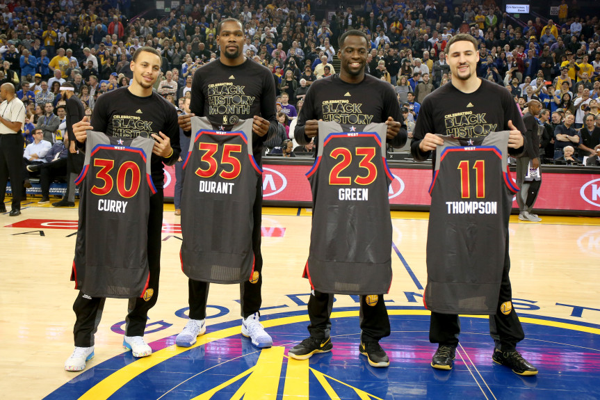
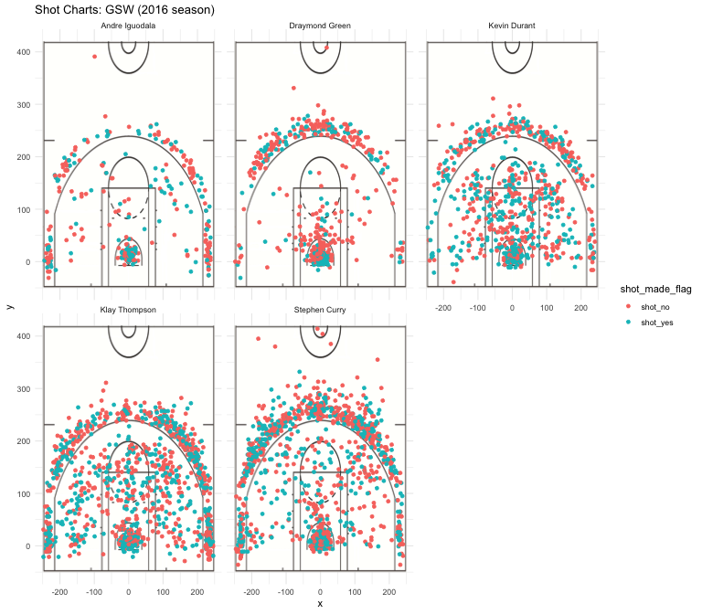

Workout 01
================
Shivansh Kumar
13 March 2019

Statistical Analysis of Warriors Championship Run as a Jump Shooting Team
=========================================================================

After coming from one of the biggest heartbreaks and disappointing final result in NBA history, the Warriors management amazingly were able to sign one of the best basketball players on the planet. Kevin Durant would join the tandem of Steph Curry, Draymond Green, Klay Thompson, and Andre Iguodala to form arguably one of the best teams in NBA history. However, the infamous Charles Barkely still had his doubts about the Warrior's goal towards a championship. He claimed, "A jump-shooting team would never win the championship." However, with statistical evidence on their side (obviously also with hours of jump shot practices), the team proves the ESPN analyst wrong.

### Effective Shooting Percentage

### 2 Pointer Effective Shooting Percentage

### 3 Pointer Effective Shooting Percentage

Field Goal Effective Shooting Percentage
----------------------------------------

